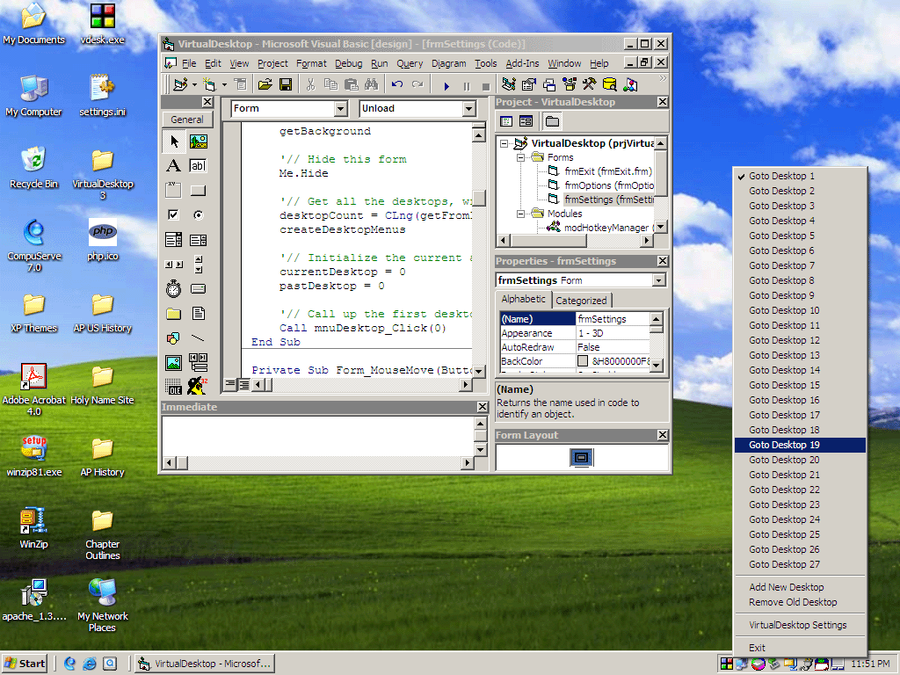



## Virtual Desktop Manager \(UPDATED VERSION 3\.0\)

### Description

NEW Version 3.0! COMPILED SETUP AVAILABLE, SEE BELOW FOR INFO. NEW FEATURES AND CREDITS BELOW. Do you have so many programs running at once that you go crazy trying to keep at least a little organized? Do you want to be able to manage multiple desktops like you can on Linux/Gnome-based interfaces? VirtualDesktop is the exact answer to this problem. This simple yet powerful utility will alow you to have up to 10 'virtual' desktops running on your system. It does this by scanning for valid windows (ignores tasks) and manages them with API calls. This code is well commented and not very large. I hope you like the utility and please comment to help me improve it. Please vote. Thanks.

NEW FEATURES FOR VERSION 2.0:

- Instant access for each desktop with new Hotkeys (CONTROL + F1, CONTROL + F2, etc.);

- Popup menu now checks the current desktop for better organization;

- Tray icon signifies the current desktop number;

- The program 'remembers' background settings for each of your 10 desktops;

NEW FEATURES FOR VERSION 3.0:

- User can Add and Remove Desktops;

- Expanded program to allow up to 1024 desktops;

- Improved tray popup menu;

- Mouse over tray icon reveals current desktop;

- Customizable hotkey configuration with the new VirtualDesktop Settings window;

- Menus now as arrays which allow for easier coding (Thanks to Bob Shull);

THANKS AND CREDITS go out to Bob Shull for his menu array coding, Clint LaFever for his suggestions and ideas, and to everyone who has commentes and contributed. If you want to help out and contribute to this ongoing project, check the top of the code in frmSettings for email information.

COMPILED SETUP AVAILABLE: I created a setup program with the compiled version 3.0 in it. Its available for download at: http://www.amoebasolutions.com/software/setup.exe Thanks for all your votes and comments.
 
### More Info
 
See code

             |
---                |---
**Submitted On**   |2002-06-15 01:53:04
**By**             |[Matt Crowley](https://github.com/Planet-Source-Code/PSCIndex/blob/master/ByAuthor/matt-crowley.md)
**Level**          |Intermediate
**User Rating**    |4.9 (355 globes from 72 users)
**Compatibility**  |VB 4\.0 \(32\-bit\), VB 5\.0, VB 6\.0
**Category**       |[Complete Applications](https://github.com/Planet-Source-Code/PSCIndex/blob/master/ByCategory/complete-applications__1-27.md)
**World**          |[Visual Basic](https://github.com/Planet-Source-Code/PSCIndex/blob/master/ByWorld/visual-basic.md)
**Archive File**   |[Virtual\_De946826152002\.zip](https://github.com/Planet-Source-Code/matt-crowley-virtual-desktop-manager-updated-version-3-0__1-35822/archive/master.zip)

### API Declarations

See code

